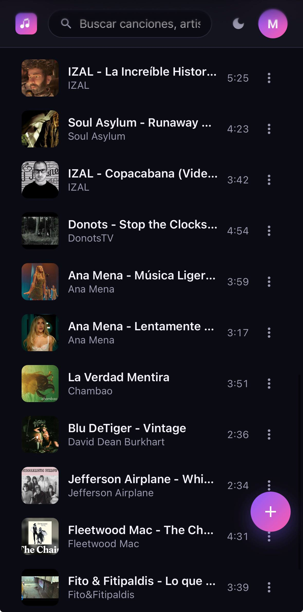
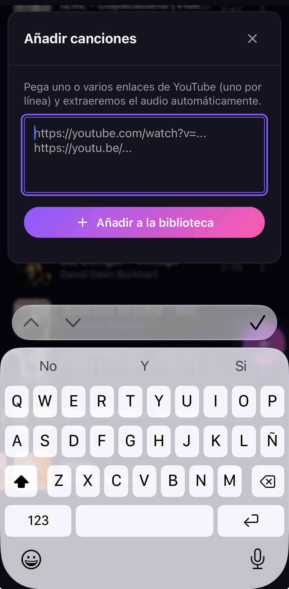
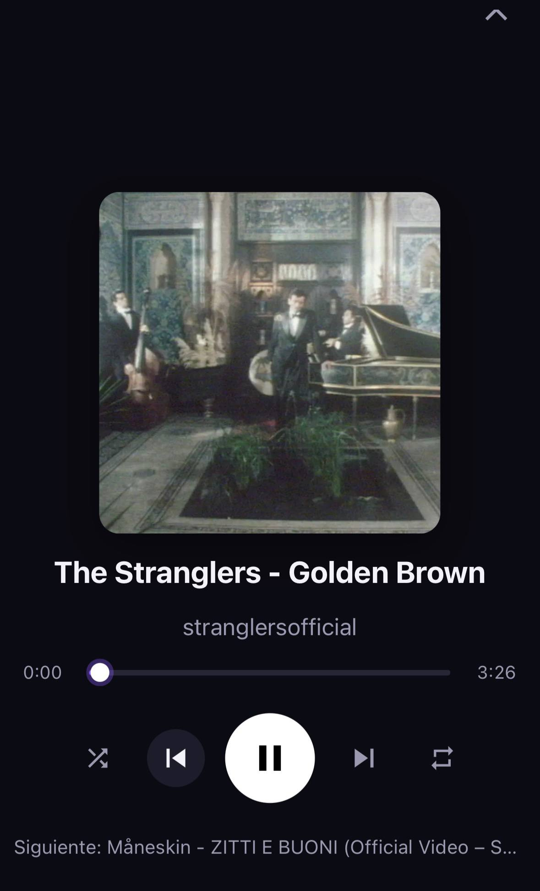
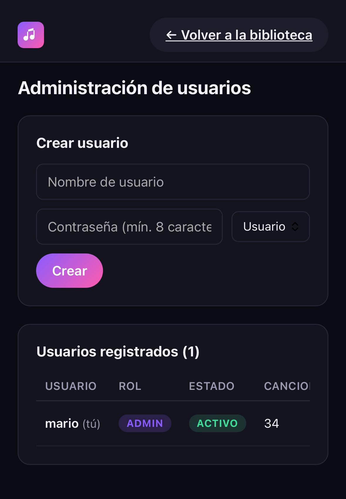

<div align="center">


# Sonara

**Tu biblioteca de música personal.** Pega un enlace de YouTube, descarga el audio y reprodúcelo desde cualquier dispositivo.

[Características](#-características) · [Capturas](#-capturas) · [Despliegue](#-despliegue-con-docker) · [Configuración](#-configuración)

</div>

---

## ✨ Características

- **Descarga automática** desde YouTube con [yt-dlp](https://github.com/yt-dlp/yt-dlp) + `ffmpeg` (audio MP3 192 kbps).
- **Biblioteca por usuario** con búsqueda, favoritos, ordenación y contadores de reproducciones.
- **Reproductor web** con cola, modo aleatorio, repetición y vista *now playing* a pantalla completa.
- **Panel de administración** para crear usuarios, asignar roles, banear y resetear contraseñas.
- **PWA instalable** con service worker que cachea el audio reproducido para uso offline.
- **Diseño oscuro, responsive**, sin dependencias de UI externas.

## 🛠 Stack

- **Backend:** Python 3.13 · Django 5.1 · gunicorn
- **Frontend:** JavaScript vanilla · CSS nativo · sin frameworks
- **Datos:** SQLite · WhiteNoise (estáticos)
- **Multimedia:** yt-dlp · ffmpeg

## 📸 Capturas

<div align="center">

### 🎵 Biblioteca
Tu colección completa con búsqueda, favoritos, ordenación y vista lista/cuadrícula.



---

### ➕ Añadir desde YouTube
Pega uno o varios enlaces y la app extrae el audio automáticamente.



---

### 🎧 Now Playing
Vista a pantalla completa con controles, progreso y siguiente canción.



---

### 🛡 Panel de administración
Gestión de usuarios: crear, banear, cambiar rol y contraseña.



</div>

## 🚀 Despliegue con Docker

```bash
docker build -t sonara .

docker run -d --name sonara \
  -p 8000:8000 \
  -v sonara-data:/app/data \
  -e SECRET_KEY="$(openssl rand -hex 32)" \
  -e DEBUG=0 \
  -e ALLOWED_HOSTS=tu-dominio.com \
  -e CSRF_TRUSTED_ORIGINS=https://tu-dominio.com \
  sonara
```

Crea el primer administrador:

```bash
docker exec -it sonara python manage.py createsuperuser
```

## 🔧 Despliegue manual

```bash
python -m venv venv
source venv/bin/activate
pip install -r requirements.txt

cp .env.example .env
# edita .env y define SECRET_KEY, ALLOWED_HOSTS, CSRF_TRUSTED_ORIGINS

python manage.py migrate
python manage.py collectstatic --noinput
python manage.py createsuperuser

gunicorn config.wsgi:application --bind 0.0.0.0:8000
```

Detrás de Nginx usa la configuración de `deploy/nginx.conf` como referencia.

## ⚙ Configuración

Variables de entorno (ver [`.env.example`](.env.example)):

| Variable | Descripción |
| --- | --- |
| `SECRET_KEY` | Clave secreta de Django (obligatoria en producción) |
| `DEBUG` | `1` para activar modo debug, `0` para producción |
| `ALLOWED_HOSTS` | Hosts permitidos, separados por coma |
| `CSRF_TRUSTED_ORIGINS` | Orígenes HTTPS de confianza para CSRF |
| `DB_PATH` | Ruta al archivo SQLite (opcional) |
| `MUSIC_UPLOADS_ROOT` | Carpeta donde se guardan los MP3 (opcional) |

## 📁 Estructura

```
.
├── apps/
│   ├── accounts/    # login, logout, panel admin de usuarios
│   └── music/       # modelos, descarga yt-dlp, streaming
├── config/          # settings, urls, wsgi
├── templates/       # Django templates
├── static/
│   ├── css/         # estilos
│   ├── js/          # app + player
│   ├── icons/       # icon.svg (favicon vectorial)
│   └── images/      # logo.png y derivados (192/512, favicon, apple-touch)
├── docs/screenshots/ # capturas para el README
├── deploy/          # nginx.conf y unidad systemd de referencia
├── Dockerfile
├── manage.py
└── requirements.txt
```

## 📄 Licencia

MIT
